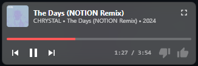

# YouTube Music Desktop App

A simple desktop application for **YouTube Music**.

    

---
**YouTube Music Player**

---

## Features

- **Filter Connection**: Filters network requests using multiple filter lists (EasyList, EasyPrivacy, uBlock filters, Ghostery filters).
- **Multi-language Support**: Automatically detects system locale with support for English, Spanish, Italian, and Portuguese by [@Rode1000](https://github.com/Rode1000).
- **Minimize to Tray**: Minimize to the system tray and keep music playing (remembers the toggle state).
- **Mini Player**: Optional always-on-top mini player with playback controls, seek bar, like/dislike, and quick return to the main window.
- **Mini Player Themes**: Change mini player theme colors from the mini player settings.
- **Remember Last Song**: Automatically reopens the last song/video you were listening to when you restart the app.
- **Resume Playback**: Resumes playback from the exact timestamp where you left off (works with "Remember Last Song").
- **Smart Caching**: Caches filter lists and updates every 24h for better performance.
- **Cast Button Removal**: Automatically hides cast/connect buttons for cleaner interface.
- **Start with System**: Launch automatically on system startup.
- **Custom Filter Lists**: Add, remove, enable/disable custom filter lists with persistent configuration.
- **Manual Filter Update**: Manually trigger filter list updates from the menu without waiting 24 hours.
- **Simple Skipper**: Automatically skips with configurable speed.
- **Auto-Continue Listening**: Automatically dismisses the "Still listening?" dialog to keep music playing without interruption.
- **Window Position Restore**: Restores last window positions and includes a tray option to reset them.
- **Keyboard Shortcuts**:
  - `Ctrl+H` - Hide to tray (when minimize to tray is enabled)
  - `Ctrl+Q` - Quit application
  - `F12` or `Ctrl+Shift+I` - Developer Tools
- **In-App Updates**: Check for and install updates directly from the app without manual downloads.
- **Discord Rich Presence**: Shows your current song and artist on Discord with album art.

## Discord Rich Presence

## Mini Player

---

## Get Started

### How to Use:

1. **Download the Installer**:
   - Visit the [Releases](https://github.com/nubsuki/YouTube-Music-Player/releases) page and download the latest version of the app installer: `YouTube Music Setup.exe`.

2. **Install the Application**:
   - Run the setup file and follow the on-screen instructions to install the app.

3. **Launch the App**:
   - Once installed, you can start the app and enjoy YouTube Music on your desktop!

### Linux
- Make sure fuse is installed
- Download the AppImage or deb package from releases

---
 ### Notes
 **Worried about account bans due to Ghostery / uBlock Origin core?**
 Use a **burner account/email** or stick with **v1.4.0** that version doesn't include any uBlock Origin core or Ghostery functionality.
Current version  with enhanced features with uBlock Origin integration.

**Important:**
If you’re upgrading from **v1.4.0** or **v1.5.0** to a newer version of this app, **make sure to delete** the folder at
`%appdata% > Roaming > youtube-music-player`
This helps avoid conflicts or unexpected behavior from older versions.

---

## License
- This software is provided "as-is" without any warranties or guarantees. 
- Licensed under the [Apache License 2.0](https://www.apache.org/licenses/LICENSE-2.0)
- uBlock Origin core by [`@gorhill/ubo-core`](https://github.com/gorhill/uBlock)
- Ghostery/adblocker by [`@ghostery`](https://github.com/ghostery/adblocker)

---