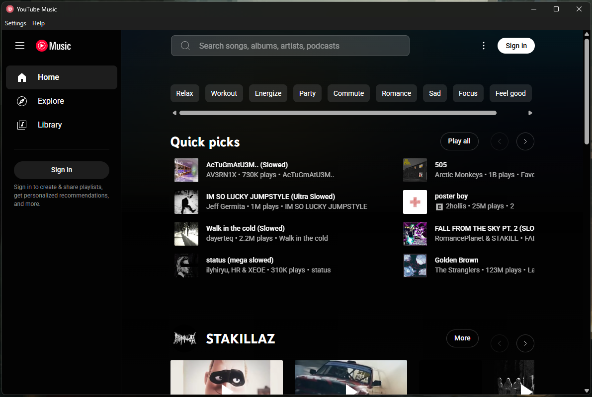

# YouTube Music Desktop App

A simple desktop application for **YouTube Music** with ad blocking capabilities.

    

---
**YouTube Music Player**

---

## Features

- **Desktop YouTube Music**: A dedicated YouTube Music app with no distractions.
- **Ad Blocking**: Blocks YouTube ads using multiple filter lists (EasyList, EasyPrivacy, uBlock filters).
- **Multi-language Support**: Automatically detects system locale with support for English and Spanish.
- **Minimize to Tray**: Close the app window to minimize it to the system tray and keep music playing (Remembers last toggle state).
- **Smart Caching**: Caches filter lists and updates every 24h for better performance.
- **Cast Button Removal**: Automatically hides cast/connect buttons for cleaner interface.
- **Start with Windows**: Launch automatically on system startup.
- **Custom Filter Lists**: Add, remove, enable/disable custom ad filter lists with persistent configuration.
- **Manual Filter Update**: Manually trigger filter list updates from the menu without waiting 24 hours.
- **Video Ad Skipper**: Automatically skips video ads with configurable speed (2-16x).
- **Keyboard Shortcuts**: 
  - `Ctrl+H` - Hide to tray (when minimize to tray is enabled)
  - `Ctrl+Q` - Quit application
  - `F12` or `Ctrl+Shift+I` - Developer Tools
- **In-App Updates**: Check for and install updates directly from the app without manual downloads.

---

## Get Started

### How to Use:

1. **Download the Installer**:
   - Visit the [Releases](https://github.com/nubsuki/YouTube-Music-Player/releases) page and download the latest version of the app installer: `YouTube Music Setup.exe`.

2. **Install the Application**:
   - Run the setup file and follow the on-screen instructions to install the app.

3. **Launch the App**:
   - Once installed, you can start the app and enjoy YouTube Music on your desktop!

### Linux
- Make sure fuse is installed
- Download the AppImage or deb package from releases

---
 ### Notes
 **Worried about account bans due to ad blocking?**
 Use a **burner account/email** or stick with **v1.4.0** that version doesn't include any ad-blocker functionality.
Current version  with enhanced ad blocking features with uBlock Origin integration.

**Important:**
If you’re upgrading from **v1.4.0** or **v1.5.0** to a newer version of this app, **make sure to delete** the folder at
`%appdata% > Roaming > youtube-music`
This helps avoid conflicts or unexpected behavior from older versions.

---

## License
- This software is provided "as-is" without any warranties or guarantees. 
- Licensed under the [Apache License 2.0](https://www.apache.org/licenses/LICENSE-2.0)
- uBlock Origin core by [`@gorhill/ubo-core`](https://github.com/gorhill/uBlock)

---